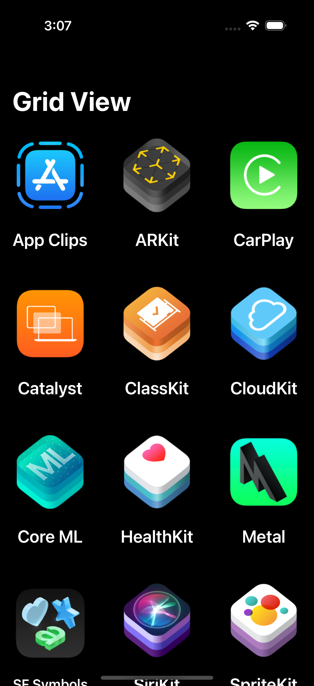
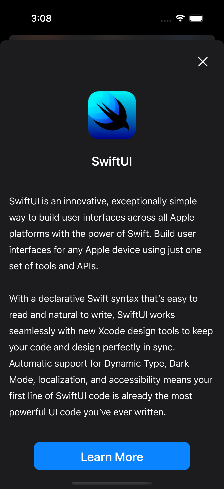
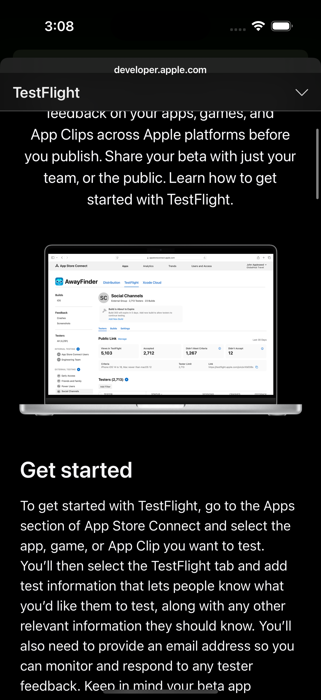

# Grid UI - iOS SwiftUI App

A modern iOS application built with SwiftUI featuring a beautiful grid layout interface with detailed views and interactive elements.

## Features

- **Grid Layout**: Clean and responsive grid interface displaying various iOS technologies
- **Detail Views**: Comprehensive detail screens for each grid item
- **Safari Integration**: Built-in Safari web view for external links
- **Modern UI**: Beautiful, native iOS design with smooth animations
- **Technology Icons**: High-quality icons representing different iOS frameworks and tools

## Technologies & Frameworks

The app showcases various iOS technologies including:

- SwiftUI
- ARKit
- CoreML
- HealthKit
- MapKit
- Metal
- SiriKit
- SpriteKit
- WidgetKit
- CloudKit
- And many more...

## Screenshots

### Main Grid View



### Detail View



### Additional View



## Project Structure

```
grid-ui/
├── MyApp.swift                 # Main app entry point
├── Assets.xcassets/           # App assets and icons
├── Model/
│   └── ListItem.swift         # Data model for grid items
├── Screen/
│   ├── DetailView/           # Detail view components
│   └── GridView/             # Grid view components
├── UIKitViews/
│   └── SafariView.swift      # Safari web view integration
└── Views/
    └── DetailButton.swift    # Custom button components
```

## Getting Started

1. Clone the repository
2. Open `grid-ui.xcodeproj` in Xcode
3. Build and run the project on your iOS device or simulator

## Requirements

- iOS 15.0+
- Xcode 14.0+
- Swift 5.7+

## Architecture

The app follows a clean SwiftUI architecture with:

- **MVVM Pattern**: ViewModels handle business logic
- **Modular Design**: Separate components for reusability
- **State Management**: Proper SwiftUI state handling
- **Navigation**: Native SwiftUI navigation patterns

## Contributing

Feel free to contribute to this project by:

1. Forking the repository
2. Creating a feature branch
3. Making your changes
4. Submitting a pull request

## License

This project is available for educational and personal use.
